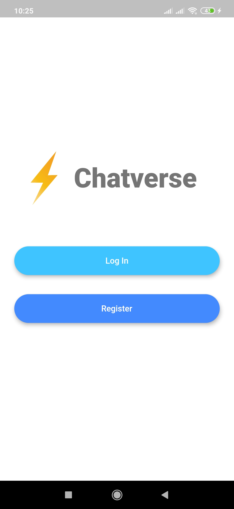
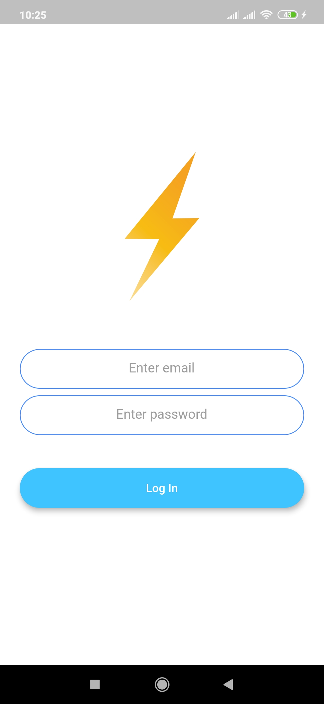
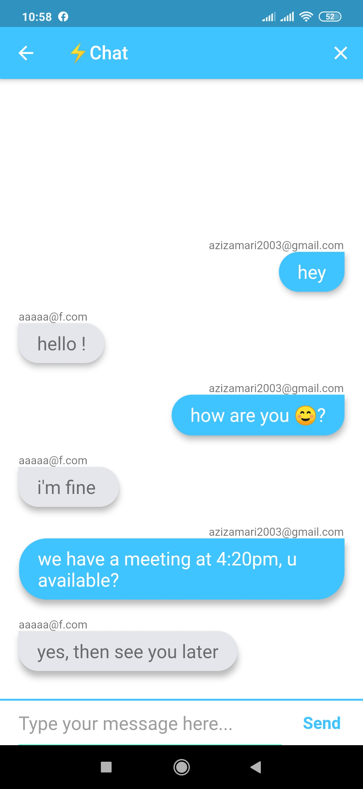

<h1> Chatverse </h1>
<h4>A mobile chatting app.</h4>
<h3>Features:</h3>
<h5> -User Authentication using Firebase auth</h5>
<h5> -Saving data in Firestore</h5>
<h5> -Encrypted data</h5>
<h5> -Instantly send and reveive messages</h5>
 
<h5>Welcome screen</h5> 

<h5>Login screen</h5> 

<h5>Chat screen</h5> 

<h3>Technologies used: <i>Flutter Dart Firebase</i></h3>
